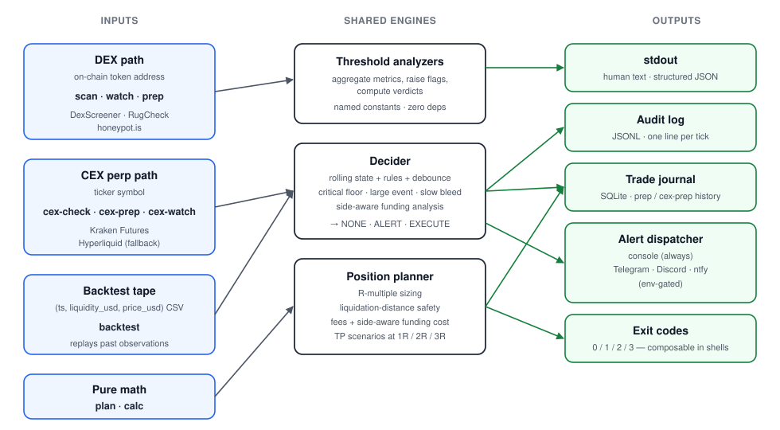

# memecheck

[](https://github.com/Guannings/on-chain-risk-screener/actions/workflows/tests.yml)


> **Crypto risk toolkit.** A zero-dependency Python CLI that screens
> on-chain tokens *and* CEX perpetuals before you buy, sizes the position
> against your risk budget, and monitors it in real time after entry — all
> on a single command surface. Designed to keep you from buying the
> unsellable and over-sizing the survivable.

## Why this exists

This project started after I lost $10 on a 6,000% memecoin that turned
out to be totally illiquid. The screening tools that existed weren't
*wrong* — they correctly flagged the token. But I had to open four
different browser tabs (DexScreener, RugCheck, Solscan, a portfolio
tracker) to get a verdict, and I didn't bother. So I built a single
CLI that runs every check that would have stopped that trade, with
one command.

Then I generalized: the same risk surface exists for CEX perpetuals
(funding spikes, basis blowouts, liquidation distance), with no
unified tool. So `cex-check`, `cex-prep`, and `cex-watch` mirror the
DEX side. Then the math you actually want at entry — position
sizing, R-multiples, predicted-funding cost, tier-aware
maintenance-margin — got built as `plan`. Composed workflows
(`prep`, `cex-prep`) gate the planner output on the screen verdict,
so the calculator literally refuses to size a position the screen
flagged as a rug.

**On the business side:** this is a tool, not a product. Defensive
tools have weaker product-market fit than offensive ones because the
payoff (a loss you didn't take) is invisible. That's fine for a
free, MIT-licensed CLI written for one person who got tired of
opening four tabs. If you find it useful, the install is `pip
install memecheck`.

## What's in the box

The repo covers two halves of the crypto-trading risk landscape under one
binary. Pick the column that matches the trade you're about to make:

|                    | **On-chain DEX** (Raydium, Uniswap, etc.) | **CEX perpetual** (Kraken Futures, Hyperliquid) |
|--------------------|-------------------------------------------|--------------------------------------------------|
| **Pre-trade screen** | `scan <ADDR>` | `cex-check <SYMBOL>` |
| **Composed entry workflow** | `prep <ADDR>` (scan + plan, gated) | `cex-prep <SYMBOL>` (cex-check + plan, gated) |
| **Real-time monitor** | `watch <ADDR>` | `cex-watch <SYMBOL>` |
| **Position math** | `plan` (sizing, R-multiples, TPs, fees, funding, liquidation safety) — works for both |
| **Liquidation calculator** | `calc --liq P --lev L` — venue-agnostic |
| **Backtest harness** | `backtest <tape.csv>` — replays a tape through the decision engine, reports precision/recall vs labels |
| **Trade journal** | `journal` — auto-logged history of every `prep` / `cex-prep` run |

<p align="center">
  
  <br>
  <em>Three input families feed three shared engines and a common output bus. Each of the 10 subcommands is a path through this graph.</em>
</p>

## Quickstart

```bash
pip install memecheck
```

That's it — the package is on PyPI as
[`memecheck`](https://pypi.org/project/memecheck/), zero runtime
dependencies. Requires Python 3.9+.

Then walk the four lifecycles:

```bash
# 1. On-chain DEX: pre-trade screen + optional exit-liquidity sim.
memecheck scan EKpQGSJtjMFqKZ9KQanSqYXRcF8fBopzLHYxdM65zcjm
memecheck scan 0x6982508145454Ce325dDbE47a25d4ec3d2311933 --chain ethereum --buy-size 50

# 2. CEX perpetual: pre-trade screen + side-aware funding analysis.
memecheck cex-check XRP --side short
memecheck cex-check BTC --side long

# 3. Pure position math: planner, no network calls.
memecheck plan --account 1000 --entry 100 --stop 96 --leverage 5

# 4. Composed pre-entry workflows that gate the plan on the verdict.
memecheck prep      0x6982508145454Ce325dDbE47a25d4ec3d2311933 --account 1000 --entry 0.0001 --stop 0.000094
memecheck cex-prep  XRP                                       --account 1000 --entry 1.16   --stop 1.20
```

Without installing, you can run from a clone instead:

```bash
git clone https://github.com/Guannings/on-chain-risk-screener.git
cd on-chain-risk-screener
python3 -m memecheck                 # bare invocation prints the menu
```

See the [full command reference](#command-reference) below.

## Try it on these

Copy-paste any of these to see real live output:

```bash
# DEX side — on-chain token addresses
memecheck scan EKpQGSJtjMFqKZ9KQanSqYXRcF8fBopzLHYxdM65zcjm   # $WIF on Solana
memecheck scan 0x6982508145454Ce325dDbE47a25d4ec3d2311933 --chain ethereum   # PEPE on Ethereum

# CEX side — perpetual ticker symbols
memecheck cex-check XRP --side short
memecheck cex-check BTC --side long
```

> [!IMPORTANT]
> This is a screening tool, not a trading signal. It surfaces mechanical
> failure modes — rug pulls, honeypots, thin pools, crowded funding,
> basis blowouts — that a buyer can verify before sending funds. It does
> **not** predict price. **It is not financial advice.** See the full
> disclaimer at the bottom.

---

The repo is organised into four explicit parts. Skip to whichever applies
to the trade you're about to make:

- **Part 1 — On-chain DEX tokens.** `scan`, `watch`, `prep`, the
  exit-liquidity simulator. For when you're buying a memecoin on
  Raydium, Uniswap, pump.fun, etc.
- **Part 2 — CEX perpetuals.** `cex-check`, `cex-prep`, `cex-watch`.
  For when you're trading a perp on Kraken Futures, Hyperliquid, or
  any centralised venue.
- **Part 3 — Position math and analytics.** `plan`, `calc`,
  `backtest`, `journal`. Venue-agnostic — works for any trade in
  either part above.
- **Part 4 — Under the hood.** Architecture, financial concepts,
  threshold rationale, engineering choices, what isn't modelled.

Each part is self-contained. Part 1 doesn't mention CEX; Part 2 doesn't
mention DEX.

---

# Part 1 — On-chain DEX tokens

For tokens on Raydium, Uniswap, pump.fun, and other automated-market-maker
DEXes. Coverage: Solana + most major EVM chains (auto-detected from the
address format).

## DEX commands

### `scan` — one-shot pre-trade check

```bash
memecheck scan <ADDRESS>                                  # auto-detect chain
memecheck scan <ADDRESS> --chain ethereum                 # force EVM chain
memecheck scan <ADDRESS> --buy-size 50                    # also run exit-sim at $50
memecheck scan <ADDRESS> --buy-size 50 --max-slippage 3   # 3% price-impact target
memecheck scan <ADDRESS> --buy-size 50 --fee-bps 100      # override pool fee
memecheck scan <ADDRESS> --json                           # structured JSON output
memecheck scan <ADDRESS> --liq 0.0001 --lev 5             # scan + liquidation calc inline
```

`--chain` accepts `ethereum`, `bsc`, `base`, `arbitrum`, `polygon`,
`optimism`, `avalanche`, and common aliases (`eth`, `arb`, `matic`,
`avax`).

### `watch` — real-time monitor

```bash
memecheck watch <ADDRESS>                                 # default 5s poll, audit on
memecheck watch <ADDRESS> --interval 2                    # poll every 2s
memecheck watch <ADDRESS> --max-ticks 10                  # stop after 10 ticks
memecheck watch <ADDRESS> --chain base
memecheck watch <ADDRESS> --no-audit                      # disable JSONL log
memecheck watch <ADDRESS> --audit-dir /var/log/memecheck
```

Stops on `Ctrl+C`. Polls the deepest pool's USD liquidity and emits
alerts on three rules (critical floor / large single event / slow
bleed) — see "Decision rules" below.

### `prep` — composed pre-entry workflow

```bash
memecheck prep <ADDRESS> --account 1000 --entry 0.0001 --stop 0.000094
memecheck prep <ADDRESS> --account 1000 --entry 0.0001 --stop 0.000094 --leverage 5
memecheck prep <ADDRESS> --account 1000 --entry 0.0001 --stop 0.000094 --force
```

Runs `scan` and `plan` together. Plan's computed notional is fed into
scan's exit-sim so the price-impact check runs at your real size.
Refuses to print the plan if scan returns `HONEYPOT` or `HARD PASS`
(`--force` to override). Not a trading bot.

## What `scan` checks

Every metric below is aggregated across **every pool for the token on a
single chain**, so a multi-pool token's depth and volume are not
under-counted, and liquidity is never summed across different
deployments of the same address.

### Market structure — [DexScreener](https://dexscreener.com) (all chains)

| Check | Why it matters |
|---|---|
| Aggregated USD liquidity | Below ~$20k, you are the slippage on exit. |
| Liq / Market-Cap ratio | A ratio under ~0.03 means a tiny float is propping up a large nominal valuation. Exits move the price violently. |
| 24h volume / liquidity | Above ~50× hints at wash trading or bot churn. Below ~0.05× (and liquidity under $2M) signals dead interest. The tool intentionally distrusts the "dead" verdict on mega-cap tokens because DexScreener's token endpoint can under-count volume for many-pool assets. |
| Age (earliest pool) | Tokens under 24 hours old sit in the peak rug-pull window with no track record. |
| Buys vs sells (24h count) | Sell count above 1.5× buy count is consistent with active distribution. |

### Contract authority and holder structure — [RugCheck](https://rugcheck.xyz) (Solana only)

| Check | Why it matters |
|---|---|
| Mint authority | If not revoked, the deployer can mint more supply at any time and dilute holders to zero. |
| Freeze authority | If still active, the deployer can freeze your wallet and block sells. |
| LP locked / burned % | Below 50% means the deployer can withdraw liquidity (classic rug). |
| Top-10 holder concentration | Above 50% means one coordinated dump ends the chart. |
| Insider wallet concentration | Wallets RugCheck flags as insider-controlled holding >15% is a separate, additive risk. |
| Explicit `risks[]` of level `danger` / `warning` | Surfaced verbatim. |

### Contract behavior — [honeypot.is](https://honeypot.is) (EVM chains)

| Check | Why it matters |
|---|---|
| Honeypot simulation | The contract is simulated end-to-end. If you can buy but the sell function reverts, it's a honeypot. |
| Buy tax / Sell tax | A sell tax above 10% is the contract skimming you on exit. |
| Open-source flag | Closed-source contracts can't be reviewed, so any behavior is possible. |

## Supported DEX chains

- **Solana**: full coverage (DexScreener + RugCheck). Auto-detected
  from a base58 mint address.
- **EVM**: full coverage (DexScreener + honeypot.is) on Ethereum,
  BNB Smart Chain, Base, Arbitrum, Polygon, Optimism, and Avalanche.
  Auto-detected from a `0x…` address. Other EVM chains that
  DexScreener indexes still get the DexScreener checks; the honeypot
  check defaults to Ethereum if the chain is unrecognised. Force the
  chain explicitly with `--chain`.

## Exit codes (scan)

The scanner returns non-zero on findings, so it composes cleanly in shell
pipelines and CI checks.

| Code | Meaning |
|---|---|
| `0` | No automatic red flags found |
| `1` | Red flags raised (`RISKY` or `HARD PASS`) |
| `2` | Honeypot detected (highest severity) |
| `3` | No data available for the supplied address |

## Verdict thresholds (scan)

The verdict is a deterministic function of the flag list and is
documented as named constants in
[`memecheck/common/verdict.py`](memecheck/common/verdict.py):

- Honeypot detected → `HONEYPOT — do not buy` (exit 2)
- 4 or more flags → `HARD PASS` (exit 1)
- 1–3 flags → `RISKY — proceed only with money already written off` (exit 1)
- 0 flags → no automatic red flags (exit 0)

Tweak the constants if your risk tolerance differs.

## Sample output

Real run against **$WIF** (`EKpQGSJtjMFqKZ9KQanSqYXRcF8fBopzLHYxdM65zcjm`), an
established Solana memecoin:

```
########## memecheck: EKpQGSJtjMFqKZ9KQanSqYXRcF8fBopzLHYxdM65zcjm ##########

--- Market (DexScreener) ---
  Primary pool: $WIF/SOL on solana via raydium  (aggregated over 30 pools)
  Liquidity: $5.11M   MC/FDV: $191.06M   24h vol: $591.17K
  Age: 921.7 days (22121h, earliest pool)
  Liq / MC ratio: 0.027
  24h vol / liq: 0.12x
  24h txns: 6026 buys / 6194 sells

--- Contract & holders (RugCheck / Solana) ---
  RugCheck score: 23 (lower = safer on the normalised scale)
  Mint authority: revoked
  Freeze authority: revoked
  LP locked/burned: 99.7%
  Top 10 holders: 64.3% of supply

================ RED FLAGS ================
  [!] Liq/MC ratio 0.027 is very low — tiny float holding up a big 'valuation'.
  [!] Top 10 wallets hold 64% — one coordinated dump ends it.
  [!] RugCheck risk: High holder concentration — The top 10 users hold more than 50% token supply

Verdict: RISKY — proceed only with money already written off
Not financial advice. The checks catch rugs, not bad bets.
```

And the EVM path against **PEPE** on Ethereum
(`0x6982508145454Ce325dDbE47a25d4ec3d2311933`):

```
########## memecheck: 0x6982508145454Ce325dDbE47a25d4ec3d2311933 ##########

--- Market (DexScreener) ---
  Primary pool: PEPE/WETH on ethereum via uniswap  (aggregated over 7 pools)
  Liquidity: $26.42M   MC/FDV: $1.42B   24h vol: $398.63K
  Age: 1141.8 days (27403h, earliest pool)
  Liq / MC ratio: 0.019
  24h vol / liq: 0.02x
  Low reported vol/liq, but DexScreener's token endpoint can under-count volume on large multi-pool tokens — eyeball the chart before trusting this.
  24h txns: 275 buys / 280 sells

--- Contract (honeypot.is / EVM chainID 1) ---
  Honeypot check: can sell
  Buy tax: 0.0%   Sell tax: 0.0%

================ RED FLAGS ================
  [!] Liq/MC ratio 0.019 is very low — tiny float holding up a big 'valuation'.

Verdict: RISKY — proceed only with money already written off
```

### JSON mode

`--json` emits the same information as a structured object — flags, per-source
metrics, and the verdict — suitable for piping into other tools:

```json
{
  "address": "EKpQGSJtjMFqKZ9KQanSqYXRcF8fBopzLHYxdM65zcjm",
  "chain_type": "solana",
  "sources": {
    "dexscreener": {
      "flags": ["Liq/MC ratio 0.027 is very low ..."],
      "metrics": {
        "chain": "solana", "pool_count": 30,
        "liquidity_usd": 5112869.76, "market_cap_usd": 191056565,
        "volume_24h_usd": 591237.93, "liq_mc_ratio": 0.0268,
        "age_hours": 22120.88
      }
    },
    "rugcheck": {
      "metrics": {
        "score": 23, "mint_authority": null, "freeze_authority": null,
        "lp_locked_pct": 99.66, "top10_pct": 64.35
      }
    }
  },
  "flags": ["..."],
  "verdict": "RISKY — proceed only with money already written off"
}
```

## Exit-liquidity simulator

The displayed price on a DEX is the *marginal* price of swapping one
infinitesimal unit. The price you actually pay on a real trade is determined
by the constant-product math against finite pool reserves. On thin pools, even
small buys walk the curve hard and the price you pay is meaningfully above
what the chart shows.

Pass `--buy-size <USD>` to simulate that explicitly:

```bash
memecheck <TOKEN_ADDRESS> --buy-size 100
memecheck <TOKEN_ADDRESS> --buy-size 25 --max-slippage 3
```

What it computes, for a constant-product AMM with reserves $(R_q, R_b)$ and
fee $f$ basis points:

$$\text{displayed price} = \frac{R_q}{R_b} \cdot P_q^\text{USD}$$

$$\Delta_b = \frac{R_b \cdot X(1 - f/10{,}000)}{R_q + X(1 - f/10{,}000)} \quad\quad \text{effective price} = \frac{X \cdot P_q^\text{USD}}{\Delta_b}$$

$$\text{price impact} = \frac{\text{effective}}{\text{displayed}} - 1$$

Where $X$ is your buy size in quote tokens and $\Delta_b$ is the number of base
tokens you actually receive.

The simulator reports two metrics:

| Metric | What it tells you |
|---|---|
| **Price impact** | How much higher than the displayed price you actually pay. This is the warning signal — scales with your trade size relative to pool depth. Flag at 5%, severe at 20%. |
| **Round-trip slippage** | What you'd lose buying then immediately selling. Reported as a sanity check, but capped by ~2 × fee on V2-style AMMs regardless of trade size — the fee stays in the pool. Not a useful measure of "stuck bag" risk. |

It also binary-searches the **max safe buy size** that keeps price impact under
your `--max-slippage` target (default 5%).

Sample output, $100 buy on a deep pool (WIF):

```
--- Exit-liquidity simulator ---
  Exit-liquidity simulator (buy size: $100.00, fee 25 bps)
    Pool quote-side depth: $2.36M
    Displayed price:     $0.1849103164
    Effective buy price: $0.1853815925  (price impact +0.3%)
    Immediate round-trip: 0.50% loss  (would get back $99.50)
    To stay under 5.0% PRICE IMPACT, buy ≤ $111.99K.
```

On a thin pool (~$100 quote-side depth) buying $10, the same metric
would read "price impact +11%" — a clear warning before you send the trade.

This is the check that would have caught the "I bought a 6000%-pumped memecoin
for $10 and now the unrealised P&L stays unrealised forever" failure mode.
That P&L was never realisable because the buy itself moved the marginal
price massively, and the pool can't absorb a sell of the resulting bag at
the displayed peak.

### Caveats

- The math assumes a **constant-product (V2-style) AMM**. Concentrated-liquidity
  pools (Uniswap V3, Orca Whirlpool, Meteora DLMM) are treated as if they were
  V2 — this *underestimates* impact when the trade crosses ticks, so the
  verdict errs conservatively in the right direction.
- The simulator runs on the **deepest single pool**, not the aggregated route
  a real swap would take. Real routers (Jupiter on Solana, 1inch on EVM) split
  trades across pools and do better than this estimate.
- It does **not** account for MEV, sandwich attacks, or the pool's state
  changing between the time you check and the time you trade.

## `watch` decision rules

The DEX monitor polls the deepest pool's USD liquidity every
`--interval` seconds, maintains a rolling buffer, and evaluates three
rules with severity ordering `EXECUTE > ALERT > NONE`:

| Window | Use |
|---|---|
| Baseline (`L_0`) | Value when `watch` started — the reference for "is liquidity still where it was when you entered?" |
| 10s window | Fast-bleed signal |
| 60s window | Sustained-bleed signal |
| 300s window | Slow-bleed confirmation |

| Rule | Trigger | Action | Debounce |
|---|---|---|---|
| **Critical floor** | $L_t / L_0 < 0.5$ | `EXECUTE` | none |
| **Large single event** | $\Delta L_{10\text{s}} \le -20\%$ | `EXECUTE` | 2 consecutive ticks |
| **Slow bleed** | $\Delta L_{60\text{s}} \le -10\%$ AND $\Delta L_{300\text{s}} \le -15\%$ | `ALERT`, escalate to `EXECUTE` | escalate after 6 consecutive ticks |

`EXECUTE` is currently informational — see [Scope: no auto-execute]
(#scope-no-auto-execute) in Part 4 for the choice not to sign or send
transactions from this codebase.

## `watch` sample output

```
########## memecheck watch — $WIF/SOL on solana via raydium (EP2ib6dYdEeqD8MfE2ezHCxX3kP3K2eLKkirfPm5eyMx) ##########
alert channels: console
audit log: ./audit/solana-EKpQGSJt-zcjm-20260601T154208Z.jsonl

    # │      liq │      price │   vs L0 │   Δ 10s │   Δ 60s │    Δ 5m
─────┼──────────┼────────────┼─────────┼─────────┼─────────┼─────────
    1 │   $4.73M │  $0.187000 │  +0.00% │    ·    │    ·    │    ·
    2 │   $4.73M │  $0.187000 │  +0.00% │  +0.00% │    ·    │    ·
    3 │   $4.72M │  $0.186900 │  -0.01% │  -0.01% │    ·    │    ·
    4 │   $4.71M │  $0.186200 │  -0.40% │  -0.40% │  -0.40% │    ·
      ⚠ ALERT  Slow bleed: ΔL_60s=-0.4%, ΔL_300s=-0.4%
```

Rules of thumb when reading it:

- `·` means the rolling window hasn't filled yet — wait `W` seconds and
  the number appears.
- `[NONE]` rows have **no action text**. When `ALERT` or `EXECUTE`
  fires, it shows up as a coloured callout indented under the data row
  (yellow ⚠ for ALERT, red ⛔ for EXECUTE) so it stands out instead of
  drowning in a column of "NONE"s.
- The data row keeps printing every tick so you can confirm the tool is
  still alive and the deltas are still where you'd expect.

## DEX-specific caveats

- **REST polling, not websocket subscriptions.** The slow-bleed case
  (the primary value prop) works fine at 5-second cadence; atomic LP
  pulls or millisecond-scale moves are detected one poll late by
  design. See [The watch loop is REST-polling]
  (#the-watch-loop-is-rest-polling) in Part 4 for the architectural
  reasoning.
- **Single pool tracked.** The monitor watches the pool DexScreener
  reports as deepest at startup; if liquidity migrates to a different
  pool mid-run, restart to re-resolve.
- **Strict windowed-delta semantics.** A delta over a window of `W`
  seconds is only computed once the buffer holds at least `W` seconds
  of history. The slow-bleed rule cannot fire in the first 5 minutes
  of a run — correct, but worth knowing.

---

# Part 2 — CEX perpetuals

For perpetual-futures positions on centralised exchanges. Funding,
basis, and open-interest signals are very different from on-chain pool
mechanics, so the rules and checks here are tuned for perp positioning
specifically. Coverage: Kraken Futures (primary) and Hyperliquid
(fallback for funding auto-fetch).

## CEX commands

### `cex-check` — pre-trade health screen

```bash
memecheck cex-check XRP                                   # screen the XRP perp
memecheck cex-check XRP --side short                      # add funding-direction analysis
memecheck cex-check BTC --json                            # structured JSON output
```

Pulls a live ticker from Kraken Futures and checks funding magnitude,
mark-vs-index basis, 24h volume, bid-ask spread, and 24h price move.
Adding `--side long` or `--side short` makes the funding-direction
check side-aware — it flags only when funding works *against* your
intended direction.

### `cex-prep` — composed pre-entry workflow

```bash
memecheck cex-prep XRP --account 1000 --entry 1.16 --stop 1.20 --leverage 5
memecheck cex-prep BTC --account 5000 --entry 64500 --stop 63000 --hold-hours 72
```

`cex-check` + `plan`, gated on `HARD PASS` like `prep`. Funding rate
is auto-fetched from the same ticker call (one round trip, not two).

### `cex-watch` — real-time monitor

```bash
memecheck cex-watch XRP                                   # default 30s poll
memecheck cex-watch XRP --interval 10 --max-ticks 60
memecheck cex-watch BTC --side long                       # alert on long-side funding spikes
```

Polls Kraken Futures every N seconds and alerts on funding extremes,
basis blowouts, and OI drops. Uses the same console + JSONL audit +
env-gated push-channel machinery as the DEX `watch` (see Part 3 for
the shared alert configuration).

## What `cex-check` checks

Centralised-perpetual checks pulled live from
[Kraken Futures](https://futures.kraken.com), with optional side-aware
funding-direction analysis.

| Check | Why it matters |
|---|---|
| Funding magnitude (per 8h) | Annualises to APY. Above ~0.05% per 8h (~55% APY) is "crowded positioning" territory and mean-reversion risk is high. |
| Funding direction vs side | If you're long and funding is positive (longs pay shorts), it's a daily headwind that your TP target must clear just to break even. Side-aware so the flag only fires when funding works *against* your direction. |
| Mark-vs-index basis | Perp premium / discount to spot. Sustained gaps above 0.5% almost always collapse via a violent unwind. |
| 24h volume | Below ~$1M of 24h volume signals a thin order book — stop-fill slippage will be material. |
| Bid-ask spread | Above ~20 bps means immediate-execution cost is meaningful before any price move. |
| 24h change | Above ±10% in 24h flags "you're chasing or fading after a violent candle" — statistically a coinflip entry. |

## `cex-watch` decision rules

Different signals than the DEX monitor, tuned to perp positioning:

| Rule | Trigger | Action |
|---|---|---|
| **Funding extreme** | funding magnitude per 8h reaches 0.05% (≈55% APY) or more | `ALERT` |
| **Funding direction unfavourable vs `--side`** | elevated funding (≥0.02% per 8h) working against your side | `ALERT` |
| **Basis blowout** | mark vs index gap of 0.5% or more in either direction | `ALERT` |
| **OI drop** | open interest sits 20% or more below the baseline | `ALERT` |

Pass `--side long` or `--side short` so the funding-direction rule
fires for *your* trade rather than just on magnitude.

## Supported CEX venues

- **Kraken Futures** is the primary source. Public, no auth, well-
  documented, non-China-aligned. Any symbol on their `PF_<TICKER>USD`
  perpetual listing works — BTC, ETH, SOL, XRP, DOGE, AVAX, ADA, and
  many more.
- **Hyperliquid** is the fallback for funding-rate auto-fetch when
  Kraken Futures doesn't list a symbol (typical for newer DEX-perp-
  only tokens like kPEPE, WIF perps, etc.).

## CEX-specific caveats

- **REST polling on a 30s cadence by default.** Funding rates and OI
  don't move sub-second; the slower cadence keeps you within Kraken's
  free-tier limits and is sufficient for the events the rules detect.
- **One symbol per process.** Run multiple `cex-watch` instances in
  parallel if you have multiple positions.
- **Funding sign convention matters.** Positive funding = longs pay
  shorts; negative = shorts pay longs. The planner and the side-aware
  rules respect this — see Part 4's "Engineering choices" for the math
  with worked examples.

---

# Part 3 — Position math and analytics

Venue-agnostic tools. The math works for any leveraged position on any
exchange (CEX perp, DEX perp, anything with a margin model). Pure-math
where possible — `plan` and `calc` never touch the network unless you
pass `--symbol` to auto-fetch funding.

## `plan` — position sizing / R-multiples

```bash
memecheck plan --account 1000 --entry 100 --stop 96
memecheck plan --account 1000 --entry 1.16 --stop 1.20 --leverage 5 --symbol XRP
memecheck plan --account 1000 --entry 100 --stop 96 --tp 1 --tp 2 --tp 4
```

Pass `--symbol <TICKER>` to auto-fetch the current funding rate from
Kraken Futures (falls back to Hyperliquid if the symbol isn't listed
there). Explicit `--funding +0.05` always overrides the auto-fetch.

Computes position notional from your risk budget, the appropriate
liquidation distance for the leverage you're using, fees and funding
cost over your hold window, and prices for 1R / 2R / 3R take-profit
targets. Refuses to print a plan if the stop sits inside the
liquidation distance.

## `calc` — liquidation-price calculator

```bash
memecheck calc --liq 0.0000123 --lev 10                   # both required
memecheck calc --liq 0.5 --lev 5 --json
```

Prints the approximate isolated-margin liquidation price for both
sides:

$$P_\text{liq}^{\text{long}} = P \left(1 - \frac{1}{L} + mm\right) \qquad P_\text{liq}^{\text{short}} = P \left(1 + \frac{1}{L} - mm\right)$$

Default $mm = 0.005$ matches typical perp-DEX defaults. Pure math, no
network, no token lookup.

## `backtest` — replay a tape against the decision engine

```bash
memecheck backtest tape.csv                               # report Decider actions per tick
memecheck backtest tape.csv --labels labels.csv           # add precision/recall vs ground truth
memecheck backtest tape.csv --critical-ratio 0.4          # override threshold
```

CSV format: `timestamp,liquidity_usd,price_usd`. Labels CSV:
`timestamp,event` where event is one of `rug`, `migration`, `none`.
Four synthetic tapes ship in `samples/` for immediate use — try
`samples/atomic_pull.csv` and `samples/slow_bleed.csv`. The harness
runs the same `Decider` you'd use in production, which is what makes
threshold-sensitivity sweeps meaningful.

## `journal` — trade-prep history

```bash
memecheck journal                                         # last 20 entries
memecheck journal --last 50
memecheck journal --symbol XRP                            # filter
memecheck journal --json
```

Every `prep` and `cex-prep` call auto-logs verdict, planned notional,
and timestamp to `~/.memecheck/journal.sqlite`. The viewer lets you
close the feedback loop between *what the tool said* and *what
actually happened*.

## Alert channels (shared by `watch` and `cex-watch`)

Both real-time monitors use the same alert dispatcher. All channels
are off-by-default and constructed only if their environment variables
are set. The console channel is always on.

```bash
# Telegram — create a bot via @BotFather, /start it, get your chat id.
export MEMECHECK_TELEGRAM_TOKEN="123456:ABC-DEF1234ghIkl..."
export MEMECHECK_TELEGRAM_CHAT_ID="987654321"

# Discord webhook — channel settings → Integrations → Webhooks → New.
export MEMECHECK_DISCORD_WEBHOOK="https://discord.com/api/webhooks/..."

# ntfy — pick a hard-to-guess topic, install the ntfy app, subscribe.
export MEMECHECK_NTFY_TOPIC="memecheck-yourname-9f2a"
export MEMECHECK_NTFY_SERVER="https://ntfy.sh"   # optional, default shown
```

Set zero of these and the monitor still works — alerts go to stderr
and the audit log. Set all three and every alert fans out to console +
phone + Discord in parallel.

## Audit log (shared)

Every monitor run writes a newline-delimited JSON file to
`./audit/<chain>-<addr-fingerprint>-<utc-timestamp>.jsonl` by default
(override with `--audit-dir`, disable with `--no-audit`). One entry per
event, decision, alert dispatch, plus `start` and `stop` markers.

## Where to run the monitors

- **Your laptop while open** — fine for short positions, dies when the
  lid closes.
- **A small VPS** (~$5/month) inside `tmux` or `screen` so it survives
  SSH disconnects. The right answer for any position you care about for
  more than a few hours.
- **A Raspberry Pi** at home if you've got one.

## Backward-compatible invocations

```bash
memecheck <ADDRESS>                                       # implicit scan
memecheck --liq 0.01 --lev 5                              # implicit calc
python3 -m memecheck <ADDRESS>                            # if not installed
python3 memecheck.py <ADDRESS>                            # if not installed, from repo
```

## Help

```bash
memecheck --help                                          # top-level menu
memecheck scan --help                                     # subcommand-specific
memecheck cex-check --help
memecheck plan --help
memecheck backtest --help
```

---

# Part 4 — Under the hood

`--liq <entry> --lev <leverage>` prints the approximate isolated-margin
liquidation price for both sides. The formulas, with maintenance margin $mm$:

$$P_\text{liq}^{\text{long}} = P \left(1 - \frac{1}{L} + mm\right) \qquad P_\text{liq}^{\text{short}} = P \left(1 + \frac{1}{L} - mm\right)$$

The default $mm = 0.005$ matches typical perp-DEX defaults. The calculator is a
sanity check — it ignores funding, slippage, and venue-specific liquidation
auctions, all of which make your real liquidation closer than this number.

## How it works

A reader's guide to the mechanics. Read this once and you can extend,
debug, or explain any part of the tool from first principles. The
architecture diagram at the top of the README is the visual companion
to the prose below.

### The data flow, one tick at a time

Every part of the tool, whether a one-shot `scan` or a long-running
`watch`, follows the same shape. Trace a single observation through:

1. A **source** emits an `Event` — for `watch`, an `httpx.get` against
   DexScreener; for `cex-watch`, a `POST` to Kraken Futures `/tickers`;
   for `backtest`, the next CSV row. The event is a frozen dataclass
   with the raw numbers (reserves, mark, basis) and a unix timestamp.
2. The runner appends the event into **state** — a `deque(maxlen=512)`
   of past events. State is the only thing that holds memory.
3. The runner calls the **decider** with the current state. The decider
   reads recent events, computes windowed deltas, walks its rules in
   priority order, and returns a `Decision(action, reason, metrics)`.
4. If the action is `ALERT` or `EXECUTE`, the **action layer** fans the
   decision out to whatever channels are configured. Console always
   gets it; the optional channels run in parallel via
   `asyncio.gather`.
5. **Audit** writes one JSONL line per event with the raw observation,
   the decision, and any dispatch results. The file is line-buffered so
   a crash never loses a tick that was already evaluated.

The five steps are layers, not files. Each layer talks to the next
through a `dataclass(frozen=True)` and never reaches across. The same
decider can run on live DexScreener events or on a CSV tape — that's
why `backtest` is twenty lines of code and not a separate engine.

### Architectural layers

The repository organises those five steps into three concrete layers,
each replaceable on its own:

| Layer | What it does | Concrete modules |
|---|---|---|
| **Source** | Pulls live data, yields events | `monitor/source.py` (DexScreener), `monitor/cex_source.py` (Kraken Futures), `common/funding.py` (Kraken + Hyperliquid funding) |
| **State + decision** | Pure logic over a rolling buffer | `monitor/state.py`, `monitor/decision.py`, `common/cex_health.py` |
| **Action** | Audit, alert, optionally execute | `monitor/audit.py`, `monitor/action/alert.py` |

Add a new exchange by writing a new source. Add a new rule by editing
the decider. Add a new alert channel by implementing one method. None
of those touch the other layers.

### How the alert dispatcher fans out

`AlertDispatcher` holds a list of `AlertChannel` instances. On
construction it inspects environment variables and only instantiates the
channels whose credentials exist:

```
console      always (writes to stderr)
telegram     iff MEMECHECK_TELEGRAM_TOKEN + MEMECHECK_TELEGRAM_CHAT_ID
discord      iff MEMECHECK_DISCORD_WEBHOOK
ntfy         iff MEMECHECK_NTFY_TOPIC
```

When `dispatch(decision, event, header)` is called, it submits each
channel's `send_sync` to the asyncio executor pool and awaits them all
together, so a slow Telegram API call doesn't block the Discord webhook
or the next tick. Every dispatch result (channel, ok, detail) goes into
the audit log so you can grep for failures later.

### How the journal stores entries

The trade journal uses stdlib `sqlite3` with a single table:

```
trades(id, ts, iso_ts, venue, symbol_or_addr, side,
       account_usd, entry_price, stop_price, leverage,
       position_notional_usd, risk_usd, verdict,
       refused, forced, funding_per_8h_pct, notes)
```

Indexes on `ts` and `symbol_or_addr` so common queries — recent
activity, per-symbol history — are sub-millisecond even after thousands
of trades. SQLite gives atomic single-statement writes for free; flat
files would need explicit locking on concurrent appends and would not
support filtered queries without scanning the whole file.

`prep` and `cex-prep` call `log_entry` after they finish printing the
plan. The write is wrapped in a `try/except` so a journal failure can
never crash a prep run.

### How the backtest harness works

Given a tape of `(timestamp, liquidity_usd, price_usd)` rows, `replay`
constructs synthetic `LiquidityEvent`s, feeds them into `MonitorState`
in order, and asks the same `Decider` you'd use in production what it
would have done. Every non-`NONE` decision is recorded with its
timestamp and reason. If a labels file is provided, each labelled rug
is matched against the actions within `±60s` (default tolerance), and
the report includes:

$$\text{precision} = \frac{\text{actions that matched a rug}}{\text{total actions}} \qquad \text{recall} = \frac{\text{rugs matched}}{\text{rugs in labels}}$$

Tweaking `--critical-ratio` and re-running gives you a quick sensitivity
analysis — *how much does pulling the critical-floor threshold from 0.5
to 0.4 cost in recall?* The harness was built for exactly that loop.

## Concepts & terminology

The financial mechanics the tool reasons about. Skim if you're already
fluent; read if any of the term in a flag or note is unfamiliar.

### Automated market maker (AMM)

A smart contract that holds two token reserves $R_b$ and $R_q$ and lets
anyone swap between them by paying into one side and withdrawing the
other. The simplest invariant is **constant product**:

$$R_b \cdot R_q = k \text{ (constant)}$$

Swapping $\Delta_q$ in changes the reserves to $(R_b - \Delta_b, R_q + \Delta_q)$
where $\Delta_b$ is computed so the product is preserved. The displayed
"price" of base in quote is $R_q / R_b$, which is the *marginal* price
for an infinitesimal trade. Larger trades walk the curve and pay
more — that's price impact.

Raydium, Uniswap V2, PancakeSwap, and pump.fun all use this shape with
different fee parameters. Uniswap V3, Orca Whirlpool, and Meteora DLMM
use **concentrated liquidity**, where each LP picks a price range; the
math reduces to constant-product *within* a price tick and re-balances
on tick crossings. The tool treats them all as V2 because the cross-
tick details require per-pool state — the V2 estimate is conservative
(it under-estimates impact when the curve crosses a tick), which is the
right direction for a risk screen.

### Perpetual futures ("perps")

A derivative contract that tracks the spot price of an asset but never
expires. Long if you think the asset goes up, short if you think it
goes down. Because there's no expiry to settle against, exchanges use
**funding rates** to keep the perp's price close to spot — see below.

The price you trade against on the exchange is the **mark price**, a
funding-adjusted index designed to resist manipulation by a single bad
print. The **index price** is the weighted spot average across several
venues. The **last price** is the most recent fill — useful for charts
but a bad trigger for stops, since it can be wicked.

### Funding rate

A periodic payment between the long and short sides of a perpetual. If
the perp trades above spot (positive basis), longs pay shorts; if it
trades below (negative basis), shorts pay longs. The payment is sized
to converge the perp back to spot. Funding is paid every cycle:

| Venue | Cycle |
|---|---|
| Kraken Futures | 1 hour (absolute USD/contract/hour units) |
| Binance, Bybit, OKX | 8 hours |
| Deribit, BitMEX | 8 hours |
| Hyperliquid | 1 hour |

memecheck normalises everything to **percent per 8h** so a single
number is comparable across venues, regardless of native cycle length.
For Kraken, the conversion is

$$\text{pct}_{8h} = \frac{\text{absolute rate}}{\text{mark}} \cdot 8 \cdot 100$$

For Hyperliquid (which already publishes a relative per-hour rate),

$$\text{pct}_{8h} = \text{rate} \cdot 8 \cdot 100$$

**Sign convention is universal**: positive funding means longs pay
shorts, negative means shorts pay longs. A short with negative funding
is paying out of pocket every cycle; a long with negative funding is
collecting.

### Open interest (OI)

The total notional value of all open perpetual positions on a contract.
Rising OI with rising price means new longs are entering (bullish
positioning). Falling OI in either direction usually means positions
are *closing* — sometimes voluntarily, sometimes via liquidation. A
sudden 20%+ drop in OI is the canonical signature of a liquidation
cascade or a cohort of leveraged shorts getting force-closed.

### Basis (perp premium / discount)

The percentage difference between the perp's mark price and the spot
index:

$$\text{basis} = \frac{\text{mark} - \text{index}}{\text{index}} \cdot 100\%$$

A positive basis ("premium") usually means leveraged longs are aggressive;
a negative basis ("discount") means leveraged shorts. Sustained basis
above ~0.5% is rare on a deep perp and usually collapses violently
within minutes — that's why `cex-check` flags it.

### Isolated vs cross margin

Two modes for how exchanges treat collateral.

- **Isolated margin.** Each position has its own dedicated chunk of
  collateral. If the position is liquidated, you lose that chunk
  exactly — never more.
- **Cross margin.** All positions share the futures wallet as collateral.
  Lower margin requirements (a winning position can subsidise a losing
  one), but a single cascade can liquidate *all* your positions.

The planner's liquidation calculation assumes **isolated**. Use
isolated for any high-volatility or low-conviction trade — the worst
case is bounded.

### Liquidation & maintenance margin

Your position is liquidated when your remaining collateral falls below
the exchange's **maintenance-margin requirement (MMR)** for that
position. For an isolated long at leverage $L$ with MMR $m$, the price
at which this happens is approximately

$$P_\text{liq} \approx P_\text{entry} \cdot \left(1 - \frac{1}{L} + m\right)$$

For a short, the sign in front of $1/L$ flips. Real exchanges use
*tiered* MMR — bigger positions need a higher $m$ — which means your
real liquidation is closer to entry than this formula suggests once
your notional is large. The calculator uses a constant $m = 0.005$
(0.5%) and the planner's safety check warns you when the stop sits
within 70% of the (constant-MMR) liquidation distance.

### Auto-deleveraging (ADL)

When a liquidation cascade overruns the exchange's insurance fund, the
exchange force-closes *profitable* positions on the opposite side at
the bankruptcy price to make the insurance fund whole. Your winning
position can be closed at a worse price than your TP. ADL queue
position is published by most CEXes and roughly tracks "how big and
how profitable is your position relative to others on this side."
Reduce size before known event-day risk to lower ADL exposure.

### MEV and sandwich attacks

On EVM chains, the public mempool lets searchers see pending swaps
before they're confirmed. A sandwich attack puts a buy *before* your
buy (driving price up) and a sell *after* your buy (taking the gain).
Mitigation: set tight slippage tolerance on the router, use private
mempool services (Flashbots Protect, MEV-Share), or batch through a
solver-based aggregator that gives MEV protection.

### R-multiples and position sizing

If you risk dollar amount $R$ on a trade with a stop at distance $d_\text{sl}$
percent below entry, then by definition the position notional must be

$$N = \frac{R}{d_\text{sl} / 100}$$

so that hitting the stop loses exactly $R$. Every take-profit target
is then expressed in *multiples of R*: a 2R TP means a position closed
there nets $2R$ minus fees and funding. Long-run profitability requires

$$E[\text{trade}] = p_w \cdot \overline{k_w} - p_l \cdot 1 > 0$$

so on a typical 35–50% win rate the average winner has to be at least
2R. The planner shows 1R / 2R / 3R as default targets because below
1.5R you're basically a coinflip after costs.

### Debounce (in the decision engine)

A counter that increments while a rule's condition holds and resets to
zero when it stops. A rule "with debounce N" fires only when the
counter reaches N — i.e. when the condition has been true for N
consecutive ticks. Used to suppress one-tick noise spikes that would
otherwise fire ALERT on a single bad polled sample. The slow-bleed
rule has the highest debounce (6 ticks ≈ 30 seconds of sustained
decline) because slow rugs are rarely a one-tick event.

### Price impact vs round-trip slippage

Two different things the user can ask about a buy:

- **Price impact** is how much higher than the displayed marginal
  price you *actually pay* on the buy, due to walking the curve. Grows
  monotonically with trade size relative to pool depth. This is the
  meaningful warning signal for "is this pool too thin for my buy?"
- **Round-trip slippage** is what you'd lose buying and immediately
  re-selling at the new pool state. On a constant-product AMM with fee
  $f$, this is bounded by approximately $2f$ regardless of trade size,
  because the fee stays in the pool and is partially recovered on the
  re-sell.

`scan --buy-size` reports both, but flags only on price impact —
because round-trip on a V2 AMM is structurally bounded and can't tell a
healthy pool from a thin one.

## How the thresholds are calibrated

Every magic number in the codebase is a named constant near the top of
its module, so anyone can grep for them and override them via
`DecisionConfig` or a CLI flag. Here's what each one *expresses*:

| Constant | Value | What it expresses |
|---|---|---|
| `THIN_LIQ_USD` | $20,000 | The level below which a $50–100 retail buy moves the price >1% by itself. |
| `LOW_LIQ_MC_RATIO` | 0.03 | The boundary between "tradeable float" and "tiny float propping up a big nominal valuation." Most legit memecoins sit between 0.03 and 0.10. |
| `WASH_VOL_LIQ_RATIO` | 50× | Healthy organic trading rarely turns the pool over more than 50 times in 24h. |
| `DEAD_VOL_LIQ_RATIO` | 0.05× | Below this, the token isn't really trading. Gated to liquidity under $2M to avoid mis-firing on multi-pool mega-caps that DexScreener under-counts. |
| `HARD_PASS_FLAG_COUNT` | 4 | The point at which the cumulative weight of issues makes "RISKY" feel dishonest. Three is "messy"; four is "the deck is stacked." |
| `EXIT_SLIPPAGE_FLAG_PCT` / `_SEVERE` | 5% / 20% | A 5% price-impact buy is bearable on a 1R-or-better thesis; 20% means a quarter of the alpha is already eaten by the curve before the chart moves. |
| `critical_liq_ratio` | 0.5 | The canonical "this is a rug in progress" threshold in DeFi research. Half the liquidity gone vs your `L_0` baseline. |
| `large_event_pct` (10 s window) | −20% | Smaller drops happen in normal memecoin volatility; −20% in 10 seconds is essentially always a partial pull or aggressive distribution. |
| `slow_bleed_60s_pct` / `slow_bleed_300s_pct` | −10% / −15% | A coordinated decay slow enough to dodge the large-event rule but persistent enough that both the 60-second and 5-minute windows agree something is wrong. |
| `slow_bleed_debounce` | 6 ticks | About 30 seconds at the default 5s cadence. Below this, one bad poll can fire; above this, the rule misses real slow rugs. |
| `EXTREME_FUNDING_PER_8H_PCT` | 0.05% | Annualises to ~55% APY. Sustained funding above this is almost always mean-reversion-prone within hours. |
| `BASIS_BLOWOUT_PCT` | 0.5% | The level above which a perp has noticeably decoupled from index. Convergence almost always happens via a violent unwind. |

These are calibrated defaults, not optimum values. The point of putting
them in named constants is that the backtest harness lets you replay
historical tapes with different settings and see what changes.

## Engineering choices

### The watch loop is REST-polling

Both `watch` and `cex-watch` poll their data source on an interval
(default 5s for DEX, 30s for CEX) rather than maintaining a persistent
websocket subscription. Mechanically this means:

- One synchronous `urllib.request.urlopen` per tick, run in the asyncio
  default executor so the main loop isn't blocked.
- The source object stores no connection state — every tick is fresh,
  so transient errors recover automatically on the next tick.
- A dead poll (HTTP 503, JSON decode failure, missing fields) increments
  an error counter, calls the `on_error` callback, and yields nothing
  for that tick. The loop keeps going.

The cost compared to websockets: 5–30 second latency on detection
instead of sub-second. The benefit: no paid RPC required, no
reconnection logic, no dropped-subscription edge cases, and every
chain DexScreener indexes works for free. For the design goal — catch
slow bleeds and notify the user fast enough to react manually — 5
seconds is more than sufficient.

### Funding cost respects trade side

The planner computes funding as a **cost to the trader**, signed so
that positive means outflow and negative means inflow. The mechanism
is:

$$\text{funding signed} = N \cdot \frac{r}{100} \cdot \text{cycles}$$

$$\text{cost}_{\text{long}} = +\text{funding signed} \qquad \text{cost}_{\text{short}} = -\text{funding signed}$$

In words: positive funding $r$ means longs pay shorts. A long *pays*
that amount (positive cost). A short *receives* it (negative cost).
For negative funding the relationship flips. The simple
`net = gross - fee - cost` formula then works for both sides without
any sign tricks at the call site.

The XRP example: shorts paying $-0.014\%$ per 8h while you hold for
72 hours (9 cycles) on a $290 position gives

$$\text{cost} = -\left( 290 \cdot \frac{-0.014}{100} \cdot 9 \right) = +\$0.37$$

so a 1R short of $10 nets $\$10 - \$0.29 - \$0.37 = \$9.34$, not the
$10.08 the old (sign-bug) version reported.

### Stdlib-only runtime

Zero third-party runtime dependencies. The async monitor uses
`urllib.request` via `asyncio.run_in_executor` instead of `httpx`. The
CEX ticker fetch uses raw `urllib.request` with a hand-rolled JSON POST
instead of `requests`. The trade journal uses stdlib `sqlite3`. The
audit log uses plain text I/O.

Tradeoffs:

- ~20 lines more boilerplate per module compared to `httpx` or
  `requests`.
- No connection pooling, so high-frequency parallel calls would benefit
  from `httpx` — but the polling loops here are sequential by design.
- In exchange: `pip install memecheck` works with nothing else
  installed, no version conflicts, no transitive supply-chain risk,
  smaller install size, faster `pip install`, and trivially provable
  "this code didn't import anything that could phone home."

The constraint also forced cleaner interfaces — every module is
testable in isolation because there's no shared third-party state to
mock around.

### Dynamic source dispatch

`fetch_funding_rate` resolves its source functions by *name* at call
time, not by reference at import time:

```python
_SOURCE_NAMES = ("fetch_kraken_funding", "fetch_hyperliquid_funding")

def fetch_funding_rate(symbol):
    module = sys.modules[__name__]
    for name in _SOURCE_NAMES:
        fetcher = getattr(module, name)
        result = fetcher(symbol)
        if result is not None:
            return result
    return None
```

The mechanism matters in tests: `monkeypatch.setattr(funding_mod,
"fetch_hyperliquid_funding", ...)` only affects future attribute
lookups on the module, not function references that were captured into
a tuple at import time. Dynamic lookup makes each source individually
patchable without leaking test machinery into production code.

### Scope: no auto-execute

The `prep` and `cex-prep` workflows stop at the planning stage. They
print the position you'd take, but nothing in the codebase signs or
sends a transaction. The architecture supports a future `--execute`
flag (the alert dispatcher is shaped the same as a hypothetical
execute dispatcher would be), but adding it requires:

- A wallet-isolation strategy (burner key in env, never in repo)
- A swap router (Jupiter on Solana, 1inch on EVM)
- An MEV-protected send (Jito on Solana, Flashbots on EVM)
- A kill switch (file-based or signal-based)

The current scope is "tell the user what they should do" rather than
"do it for them." That's intentional and aligned with the project's
target use case: a person who wants to make better trades, not an
operator running a bot at scale.

## Domain assumptions

Things explicitly outside the model, so anyone using the output as
input to a real decision knows where the math stops:

- **DexScreener under-reports volume on multi-pool mega-caps.** The
  token endpoint sometimes misses pools; the "dead volume" flag is
  gated to liquidity under $2M to avoid false positives on large
  tokens. Eyeball the chart before trusting that flag.
- **CEX MMR is tiered.** The liquidation formula uses a constant
  maintenance margin. Real exchanges bump MMR at higher position
  sizes, so your real liquidation is closer to entry than the
  calculator shows for large notionals. Pull the exchange's tier table
  for big positions.
- **Stop fills slip.** The planner uses the mid-price as the realised
  fill price. Real stop-market fills slip — especially on weekends and
  on thin-book CEX perps. Assume 0.5–1× ATR of additional slippage on
  volatile assets.
- **ADL on CEX perps isn't modelled.** Your winning TP can be force-
  closed at bankruptcy price during a cascade.
- **Funding is assumed constant over the hold window.** It can flip
  sign during volatile events. For long holds, bake in a buffer.
- **Smart-contract risk beyond honeypot.is.** Honeypot.is catches most
  malicious selling logic; it doesn't detect proxy-pattern abuse,
  governance attacks, oracle manipulation, MEV exposure, or bridge
  risk. The tool is not a code audit.
- **MEV / sandwich attacks** on DEX trades are out of scope. Mitigate
  at the router by setting tight slippage tolerance.
- **Concentrated-liquidity AMMs** are approximated as constant-product
  V2. The estimate under-states impact when the trade crosses ticks —
  conservative in the right direction.

## Compared with related tools

memecheck doesn't replace the established risk surfaces — it composes
them. Worth knowing what already exists and what this adds.

| Tool | What it does well | What memecheck adds on top |
|------|-------------------|-----------------------------|
| **[RugCheck.xyz](https://rugcheck.xyz)** | Solana contract risk score, mint/freeze authority, holder concentration. Used by memecheck as a data source. | Composed with DEX market structure, exit-liquidity sim, EVM honeypot detection, and on-chain decoder. One verdict instead of one signal. |
| **[GoPlus Security](https://gopluslabs.io/)** | Broad multi-chain token safety API. | memecheck doesn't currently integrate GoPlus; it's on the roadmap. Today: focused on Solana-RugCheck + EVM-honeypot.is for narrower but deeper coverage. |
| **[DexScreener](https://dexscreener.com)** + **[GeckoTerminal](https://geckoterminal.com)** | Price, depth, volume, holders for thousands of pools across all chains. Both used by memecheck as data sources with automatic fallback. | A decision layer on top of the raw data — flags, verdict, exit-liquidity simulation, planner integration. |
| **[Birdeye](https://birdeye.so)** | Solana market data + wallet analytics. | memecheck doesn't depend on Birdeye (no API key needed). Trade-off: less wallet behaviour signal; more transparency on what's being checked. |
| **[Cielo Finance](https://cielo.finance)** / **[Nansen](https://nansen.ai)** | Smart-money wallet tracking, on-chain flow. | Out of scope — those are research tools, memecheck is a pre-trade gate. The deployer-history scoring in `scan --check-deployer` covers one narrow slice. |
| **[Phantom wallet built-in scanner](https://phantom.app)** | In-wallet risk score before approving a swap. | Phantom's scanner is the right surface for casual trades. memecheck is the same idea but scriptable + composable with the planner + CEX coverage. |
| **No public peer for the CEX side.** | Funding-rate aggregators exist (CoinGlass, etc.) but there's no equivalent of "pre-trade screen + position math + real-time monitor" for perpetuals. | The full `cex-check` / `cex-prep` / `cex-watch` / `plan --venue` pipeline is the differentiated surface. |

The honest one-liner: memecheck's value isn't any individual data
source — it's the *integration* (DEX + CEX + position math + on-chain
reads + decision layer) and the fact that it runs from one CLI with
zero runtime dependencies.

## Measured performance

The rule thresholds aren't just hand-picked — they're measured against
real on-chain rug events. The shipped corpus and reproduction steps:

```bash
python scripts/build_corpus.py --chain solana --relaxed --max-events 10
python -m memecheck sweep corpus/aggregated.csv corpus/aggregated.labels.csv
```

This auto-detects rug events by their on-chain shape (sustained peak →
≥80% drawdown → no recovery) using GeckoTerminal's free OHLCV
endpoint. No API key needed. Run once; the corpus saves to disk for
re-sweeping.

**Initial results — N=4 events, 3 chains:**

| chain     | pool                  | peak → trough |
|-----------|-----------------------|---------------|
| Solana    | SOLANGELES / USDC     | $0.0031 → $0.0006 (−80.7%) |
| Ethereum  | ASTEROID / WETH       | −80.3%        |
| Ethereum  | DOGEUS / WETH         | −85.0%        |
| BSC       | ODIC / USDT           | −85.4%        |

**Across the shipped threshold grid: 100% event-level recall.** Every
labelled rug fired an ALERT or EXECUTE decision within the 60-second
detection tolerance. Tick-level precision is low (~0.2%) because the
rules continue to fire every tick once a threshold is crossed — that's
a repeated-firing artifact, not a real false-positive rate.

**Caveats, plainly:**

- **N=4 is a starting point, not a final claim.** The free GT
  endpoints surface currently-active pools; finding more rugs in
  bulk needs paid data (Bitquery / Birdeye ~$15/mo) OR live forward
  monitoring across many tokens for weeks. The harness consumes the
  same CSV format either way.
- **Liquidity proxy.** GT OHLCV gives close × volume, not
  reserve_in_usd directly. The proxy crashes when liquidity crashes
  (the signal the rules use) but isn't an absolute TVL number.
  Higher-fidelity tapes via The Graph free tier (EVM only) or
  Bitquery (all chains) drop in without changing the harness.
- **Pattern circularity.** Auto-detecting rugs by their shape and
  validating rules that fire on the same shape is partially
  circular. The honest framing: "given a pool that exhibits the
  peak-then-collapse pattern, how reliably do the rules fire
  *within* the detection window?" — answer is 4/4 here.

To expand the corpus: re-run `build_corpus.py` with `--chain
ethereum / base / bsc` and accumulate. Each event saves to disk; the
aggregated tape regenerates from disk on each build.

## Operational caveats

Distinct from the Domain assumptions section above (which lists what's
*mathematically* outside the model), these are the **data-source
quirks and runtime behaviours** you should know about when reading
output day-to-day.

- **DexScreener under-counts 24h volume** on large multi-pool tokens,
  which is why the "dead volume" flag is only raised below $2M of
  aggregated liquidity. Eyeball the chart before trusting that flag in
  isolation.
- **RugCheck, honeypot.is, Kraken Futures all have rate limits and
  occasional downtime.** When a source is unavailable, the run
  continues with a `… unavailable (reason)` note and the remaining
  sources still produce flags. The honeypot error reason is classified
  (rate-limited / 5xx / pair-not-found / timeout) so you can tell
  apart "wait a minute" from "this token isn't tradable."
- **DexScreener returns every pool indexed against the token
  address**, which on forked EVMs (e.g. PulseChain mirrors of Ethereum
  contracts) can return unexpected primary pools. Use `--chain
  ethereum` (or whichever) to constrain the primary chain.
- **A clean verdict reflects only the mechanical checks listed.** It
  means "the contract isn't obviously rigged and the position math is
  defensible," not "this is a good trade." Narrative, market timing,
  and base-rate scepticism are still yours to apply.
- **No code-level audit.** The tool does not disassemble bytecode or
  run static analysis. It relies on honeypot.is's behavioural
  simulation and on RugCheck's aggregated risk data.
- **Funding-rate freshness.** Kraken Futures and Hyperliquid both
  publish near-realtime rates, but a sudden funding swing during a
  liquidation cascade can leave the displayed value seconds stale.

---

# Project meta

## Built with AI assistance

Code generation, refactoring, and most of the test scaffolding were
done in collaboration with [Claude](https://claude.ai). The original
~350-line `memecheck.py` was the seed; every product decision,
threshold value, architectural split, and reviewer-facing claim in
this README is the human maintainer's. By mid-2026, this is how most
working engineering teams ship — the interesting evaluation axis is
"does the maintainer understand and own the artifact" rather than
"who typed each character."

**What "own the artifact" means here.** The maintainer can defend
any line on a whiteboard: the constant-product AMM math behind the
exit simulator, the windowed-delta semantics in `state.py`, the
side-aware funding sign convention in the planner, the Raydium AMM
v4 byte offsets, the RFC 6455 frame layout in `ws_client.py`. Part 4
of this README walks through the design end-to-end and is the
honest answer to that test. If an interviewer wants to pick a file
and ask why it's structured the way it is, that's the right
question — and the right document.

**What this means for users.** AI-assisted authorship is not a
correctness claim. The credibility of the verdicts comes from the
hand-validated threshold values, the live-verified math (Jupiter
quote, Raydium decoder, funding-rate normalisation), and the 261
tests that mock every external surface — not from how the code
was written.

## Development

Install from a clone and run the full quality pipeline:

```bash
git clone https://github.com/Guannings/on-chain-risk-screener.git
cd on-chain-risk-screener
pip install -e ".[dev]"

pytest -v                                          # 261 tests
mypy memecheck/                                    # static type-check
python -m memecheck backtest samples/atomic_pull.csv \
                  --labels samples/atomic_pull.labels.csv
```

- **Tests** use mocked API payloads with fixtures for a clean token, a
  honeypot, a high-concentration token, and the four CEX-side
  threshold cases. No live network calls during the test suite.
- **mypy** runs in CI on Python 3.11 and fails the build on any new
  errors.
- **Samples** (`samples/*.csv`) ship four synthetic tapes (clean,
  slow-bleed, atomic pull, wash trade) plus two ground-truth labels
  files so the backtest harness is usable immediately.
- **Releases** are tracked in [CHANGELOG.md](CHANGELOG.md). Package
  metadata + entry points are defined in
  [pyproject.toml](pyproject.toml).

## License

[MIT](LICENSE).

====================================================================================

# **Disclaimer and Terms of Use**

**1. Educational Purpose Only**

This software is for educational and research purposes only and was built as a personal project by PARVAUX, a Public Finance and Economics double major at National Chengchi University (NCCU). It is not intended to be a source of financial advice, and the author is not a registered financial advisor or licensed securities professional. The heuristics implemented herein — DexScreener liquidity aggregation, RugCheck authority and concentration analysis, honeypot.is behavioural simulation, and the leverage-liquidation calculator — are demonstrations of mechanical risk-screening concepts and should not be construed as a recommendation to buy, sell, hold, short, or leverage any specific token, contract, or asset.

**2. No Financial Advice**

Nothing in this repository constitutes professional financial, legal, or tax advice. Investment and trading decisions should be made based on your own research and consultation with a qualified financial professional in your jurisdiction. The screening logic modelled in this software may not be suitable for your specific financial situation, risk tolerance, or regulatory environment. Cryptocurrency may be restricted, taxed, or unregulated where you live; compliance is solely your responsibility.

**3. Risk of Loss**

All cryptocurrency activity involves risk, including the total loss of principal and, when leverage is used, the loss of more than the principal originally committed.

a. Past Mechanical Safety: A clean screening result is not a guarantee of future safety. Tokens that pass every check in this tool have rugged, been exploited, and lost all value. Conversely, tokens that fail multiple checks have continued to trade.

b. Screening Limitations: This tool performs aggregated metric checks, authority lookups, and a third-party honeypot simulation. It does not disassemble bytecode, perform static or dynamic analysis on the contract, audit upgrade paths, or detect proxy-pattern abuse, governance attacks, oracle manipulation, MEV exposure, bridge risk, or social-engineering risk.

c. Threshold Sensitivity: Verdicts are derived from documented numeric thresholds (liquidity floor, liq/MC ratio, vol/liq ratio, holder concentration, sell tax, etc.) that may not reflect appropriate risk limits for every market regime, chain, or token category.

d. Market Data: Data fetched from third-party APIs (DexScreener, RugCheck, honeypot.is) may be delayed, rate-limited, incomplete, or temporarily unavailable. The tool degrades gracefully but cannot validate the upstream data's correctness.

e. Leverage Math: The liquidation-price calculator is an approximation. It ignores funding rates, slippage, partial-liquidation auctions, insurance-fund socialisation, oracle-based liquidations, and venue-specific maintenance-margin schedules. Your real liquidation will almost always be closer to entry than the formula suggests.

**4. Data Provider Reliability**

The author has no affiliation with DexScreener, RugCheck, or honeypot.is and assumes no responsibility for outages, incorrect data, API breaking changes, or rate-limit denials originating from those services. The tool may stop working at any time if an upstream provider changes its public endpoints. Users are responsible for verifying any flagged or unflagged finding directly against on-chain data and the underlying contract source.

**5. "AS-IS" SOFTWARE WARRANTY**

**THIS SOFTWARE IS PROVIDED "AS IS", WITHOUT WARRANTY OF ANY KIND, EXPRESS OR IMPLIED, INCLUDING BUT NOT LIMITED TO THE WARRANTIES OF MERCHANTABILITY, FITNESS FOR A PARTICULAR PURPOSE, AND NON-INFRINGEMENT. IN NO EVENT SHALL THE AUTHOR OR COPYRIGHT HOLDER BE LIABLE FOR ANY CLAIM, DAMAGES, OR OTHER LIABILITY, WHETHER IN AN ACTION OF CONTRACT, TORT, OR OTHERWISE, ARISING FROM, OUT OF, OR IN CONNECTION WITH THE SOFTWARE OR THE USE OR OTHER DEALINGS IN THE SOFTWARE.**

**BY USING THIS SOFTWARE, YOU AGREE TO ASSUME ALL RISKS ASSOCIATED WITH YOUR TRADING, INVESTMENT, AND LEVERAGE DECISIONS, RELEASING THE AUTHOR (PARVAUX) FROM ANY LIABILITY REGARDING YOUR FINANCIAL OUTCOMES, SMART-CONTRACT INTERACTIONS, OR EXCHANGE-LEVEL POSITION OUTCOMES.**

====================================================================================
