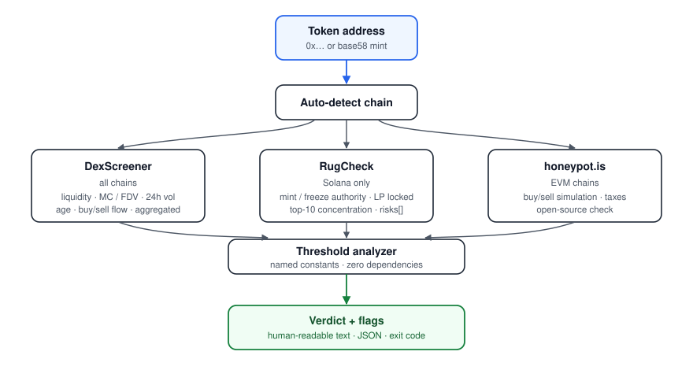

# memecheck

[](https://github.com/Guannings/on-chain-risk-screener/actions/workflows/tests.yml)


> **Catch the rug before it pulls.** A zero-dependency Python CLI that screens
> any Solana or EVM token in under three seconds by aggregating three live
> public sources — DexScreener, RugCheck, and honeypot.is — into a deterministic
> red-flag verdict.

<p align="center">
  
</p>

## Quickstart

```bash
git clone https://github.com/Guannings/on-chain-risk-screener.git
cd on-chain-risk-screener
pip install .
```

Then either of the two lifecycles:

```bash
# Pre-trade: a one-shot risk screen.
memecheck scan <TOKEN_ADDRESS>
memecheck scan <TOKEN_ADDRESS> --buy-size 50    # add an exit-liquidity sim

# Post-trade: a real-time monitor on the deepest pool.
memecheck watch <TOKEN_ADDRESS>
```

If you'd rather not `pip install`, both of these work without it:

```bash
python3 -m memecheck scan <TOKEN_ADDRESS>
python3 memecheck.py scan <TOKEN_ADDRESS>       # legacy invocation, still works
```

Requires Python 3.9+. **No third-party runtime dependencies** — stdlib only.

See the [full command reference](#command-reference) for every flag.

## Try it on these

The tool auto-detects chain from the address format. Copy-paste any of these to see real output now:

| Token | Address | What you'll see |
|---|---|---|
| $WIF (Solana) | `EKpQGSJtjMFqKZ9KQanSqYXRcF8fBopzLHYxdM65zcjm` | Solana path — DexScreener + RugCheck, flags a concentration risk |
| PEPE (Ethereum) | `0x6982508145454Ce325dDbE47a25d4ec3d2311933` | EVM path — DexScreener + honeypot.is, clean contract |
| USDC (Solana mint) | `EPjFWdd5AufqSSqeM2qN1xzybapC8G4wEGGkZwyTDt1v` | Stable reference — clean contract, zero relevant flags |

```bash
memecheck EKpQGSJtjMFqKZ9KQanSqYXRcF8fBopzLHYxdM65zcjm
memecheck 0x6982508145454Ce325dDbE47a25d4ec3d2311933 --chain ethereum
memecheck 0x6982508145454Ce325dDbE47a25d4ec3d2311933 --json | jq '.verdict'
```

> [!IMPORTANT]
> This is a screening tool, not a trading signal. It surfaces mechanical
> failure modes — rug pulls, honeypots, dead liquidity, insider concentration —
> that a buyer can verify before sending funds. It does **not** predict price.
> **It is not financial advice.** See the full disclaimer at the bottom.

## What it checks and why each check matters

Every metric below is aggregated across **every pool for the token on a single
chain**, so a multi-pool token's depth and volume are not under-counted, and
liquidity is never summed across different deployments of the same address.

### Market structure — [DexScreener](https://dexscreener.com) (all chains)

| Check | Why it matters |
|---|---|
| Aggregated USD liquidity | Below ~$20k, you are the slippage on exit. |
| Liq / Market-Cap ratio | A ratio under ~0.03 means a tiny float is propping up a large nominal valuation. Exits move the price violently. |
| 24h volume / liquidity | Above ~50× hints at wash trading or bot churn. Below ~0.05× (and liquidity under $2M) signals dead interest. The tool intentionally distrusts the "dead" verdict on mega-cap tokens because DexScreener's token endpoint can under-count volume for many-pool assets. |
| Age (earliest pool) | Tokens under 24 hours old sit in the peak rug-pull window with no track record. |
| Buys vs sells (24h count) | Sell count above 1.5× buy count is consistent with active distribution. |

### Contract authority and holder structure — [RugCheck](https://rugcheck.xyz) (Solana only)

| Check | Why it matters |
|---|---|
| Mint authority | If not revoked, the deployer can mint more supply at any time and dilute holders to zero. |
| Freeze authority | If still active, the deployer can freeze your wallet and block sells. |
| LP locked / burned % | Below 50% means the deployer can withdraw liquidity (classic rug). |
| Top-10 holder concentration | Above 50% means one coordinated dump ends the chart. |
| Insider wallet concentration | Wallets RugCheck flags as insider-controlled holding >15% is a separate, additive risk. |
| Explicit `risks[]` of level `danger` / `warning` | Surfaced verbatim. |

### Contract behavior — [honeypot.is](https://honeypot.is) (EVM chains)

| Check | Why it matters |
|---|---|
| Honeypot simulation | The contract is simulated end-to-end. If you can buy but the sell function reverts, it's a honeypot. |
| Buy tax / Sell tax | A sell tax above 10% is the contract skimming you on exit. |
| Open-source flag | Closed-source contracts can't be reviewed, so any behavior is possible. |

## Supported chains

- **Solana**: full coverage (DexScreener + RugCheck). Auto-detected from a
  base58 mint address.
- **EVM**: full coverage (DexScreener + honeypot.is) on Ethereum, BNB Smart
  Chain, Base, Arbitrum, Polygon, Optimism, and Avalanche. Auto-detected from a
  `0x…` address. Other EVM chains that DexScreener indexes will still get the
  DexScreener checks; the honeypot check defaults to Ethereum if the chain is
  unrecognised. Force the chain explicitly with `--chain` (see below).

## Command reference

Three subcommands. Everything else is a flag.

### `scan` — one-shot pre-trade check

```bash
memecheck scan <ADDRESS>                            # auto-detect chain
memecheck scan <ADDRESS> --chain ethereum           # force EVM chain
memecheck scan <ADDRESS> --buy-size 50              # also run exit-sim at $50
memecheck scan <ADDRESS> --buy-size 50 --max-slippage 3   # 3% impact target
memecheck scan <ADDRESS> --buy-size 50 --fee-bps 100      # override pool fee
memecheck scan <ADDRESS> --json                     # structured JSON output
memecheck scan <ADDRESS> --liq 0.0001 --lev 5       # scan + liquidation calc inline
```

`--chain` accepts `ethereum`, `bsc`, `base`, `arbitrum`, `polygon`, `optimism`,
`avalanche`, and common aliases (`eth`, `arb`, `matic`, `avax`).

### `watch` — real-time monitor

```bash
memecheck watch <ADDRESS>                           # default 5s poll, audit on
memecheck watch <ADDRESS> --interval 2              # poll every 2s
memecheck watch <ADDRESS> --max-ticks 10            # stop after 10 ticks
memecheck watch <ADDRESS> --chain base              # force EVM chain
memecheck watch <ADDRESS> --no-audit                # disable JSONL log
memecheck watch <ADDRESS> --audit-dir /var/log/memecheck
```

Stops on `Ctrl+C`. See [the watch section below](#real-time-monitor-watch) for
the decision rules, the audit log format, and the optional push-notification
channels.

### `calc` — liquidation-price calculator

```bash
memecheck calc --liq 0.0000123 --lev 10             # both required
memecheck calc --liq 0.5 --lev 5 --json             # JSON output
```

See [the liquidation calculator section below](#liquidation-price-calculator)
for the math.

### Backward-compatible invocations

```bash
memecheck <ADDRESS>                                 # implicit scan
memecheck --liq 0.01 --lev 5                        # implicit calc
python3 -m memecheck <ADDRESS>                      # if not installed
python3 memecheck.py <ADDRESS>                      # if not installed, from repo
```

### Help

```bash
memecheck --help                                    # top-level
memecheck scan --help                               # subcommand-specific
memecheck watch --help
memecheck calc --help
```

### Exit codes (scan)

The scanner returns non-zero on findings, so it composes cleanly in shell
pipelines and CI checks.

| Code | Meaning |
|---|---|
| `0` | No automatic red flags found |
| `1` | Red flags raised (`RISKY` or `HARD PASS`) |
| `2` | Honeypot detected (highest severity) |
| `3` | No data available for the supplied address |

### Verdict thresholds (scan)

The verdict is a deterministic function of the flag list and is documented as
named constants in
[`memecheck/common/verdict.py`](memecheck/common/verdict.py):

- Honeypot detected → `HONEYPOT — do not buy` (exit 2)
- 4 or more flags → `HARD PASS` (exit 1)
- 1–3 flags → `RISKY — proceed only with money already written off` (exit 1)
- 0 flags → no automatic red flags (exit 0)

Tweak the constants if your risk tolerance differs.

## Sample output

Real run against **$WIF** (`EKpQGSJtjMFqKZ9KQanSqYXRcF8fBopzLHYxdM65zcjm`), an
established Solana memecoin:

```
########## memecheck: EKpQGSJtjMFqKZ9KQanSqYXRcF8fBopzLHYxdM65zcjm ##########

--- Market (DexScreener) ---
  Primary pool: $WIF/SOL on solana via raydium  (aggregated over 30 pools)
  Liquidity: $5.11M   MC/FDV: $191.06M   24h vol: $591.17K
  Age: 921.7 days (22121h, earliest pool)
  Liq / MC ratio: 0.027
  24h vol / liq: 0.12x
  24h txns: 6026 buys / 6194 sells

--- Contract & holders (RugCheck / Solana) ---
  RugCheck score: 23 (lower = safer on the normalised scale)
  Mint authority: revoked
  Freeze authority: revoked
  LP locked/burned: 99.7%
  Top 10 holders: 64.3% of supply

================ RED FLAGS ================
  [!] Liq/MC ratio 0.027 is very low — tiny float holding up a big 'valuation'.
  [!] Top 10 wallets hold 64% — one coordinated dump ends it.
  [!] RugCheck risk: High holder concentration — The top 10 users hold more than 50% token supply

Verdict: RISKY — proceed only with money already written off
Not financial advice. The checks catch rugs, not bad bets.
```

And the EVM path against **PEPE** on Ethereum
(`0x6982508145454Ce325dDbE47a25d4ec3d2311933`):

```
########## memecheck: 0x6982508145454Ce325dDbE47a25d4ec3d2311933 ##########

--- Market (DexScreener) ---
  Primary pool: PEPE/WETH on ethereum via uniswap  (aggregated over 7 pools)
  Liquidity: $26.42M   MC/FDV: $1.42B   24h vol: $398.63K
  Age: 1141.8 days (27403h, earliest pool)
  Liq / MC ratio: 0.019
  24h vol / liq: 0.02x
  Low reported vol/liq, but DexScreener's token endpoint can under-count volume on large multi-pool tokens — eyeball the chart before trusting this.
  24h txns: 275 buys / 280 sells

--- Contract (honeypot.is / EVM chainID 1) ---
  Honeypot check: can sell
  Buy tax: 0.0%   Sell tax: 0.0%

================ RED FLAGS ================
  [!] Liq/MC ratio 0.019 is very low — tiny float holding up a big 'valuation'.

Verdict: RISKY — proceed only with money already written off
```

### JSON mode

`--json` emits the same information as a structured object — flags, per-source
metrics, and the verdict — suitable for piping into other tools:

```json
{
  "address": "EKpQGSJtjMFqKZ9KQanSqYXRcF8fBopzLHYxdM65zcjm",
  "chain_type": "solana",
  "sources": {
    "dexscreener": {
      "flags": ["Liq/MC ratio 0.027 is very low ..."],
      "metrics": {
        "chain": "solana", "pool_count": 30,
        "liquidity_usd": 5112869.76, "market_cap_usd": 191056565,
        "volume_24h_usd": 591237.93, "liq_mc_ratio": 0.0268,
        "age_hours": 22120.88
      }
    },
    "rugcheck": {
      "metrics": {
        "score": 23, "mint_authority": null, "freeze_authority": null,
        "lp_locked_pct": 99.66, "top10_pct": 64.35
      }
    }
  },
  "flags": ["..."],
  "verdict": "RISKY — proceed only with money already written off"
}
```

## Exit-liquidity simulator

The displayed price on a DEX is the *marginal* price of swapping one
infinitesimal unit. The price you actually pay on a real trade is determined
by the constant-product math against finite pool reserves. On thin pools, even
small buys walk the curve hard and the price you pay is meaningfully above
what the chart shows.

Pass `--buy-size <USD>` to simulate that explicitly:

```bash
memecheck <TOKEN_ADDRESS> --buy-size 100
memecheck <TOKEN_ADDRESS> --buy-size 25 --max-slippage 3
```

What it computes, for a constant-product AMM with reserves $(R_q, R_b)$ and
fee $f$ basis points:

$$\text{displayed price} = \frac{R_q}{R_b} \cdot P_q^\text{USD}$$

$$\Delta_b = \frac{R_b \cdot X(1 - f/10{,}000)}{R_q + X(1 - f/10{,}000)} \quad\quad \text{effective price} = \frac{X \cdot P_q^\text{USD}}{\Delta_b}$$

$$\text{price impact} = \frac{\text{effective}}{\text{displayed}} - 1$$

Where $X$ is your buy size in quote tokens and $\Delta_b$ is the number of base
tokens you actually receive.

The simulator reports two metrics:

| Metric | What it tells you |
|---|---|
| **Price impact** | How much higher than the displayed price you actually pay. This is the warning signal — scales with your trade size relative to pool depth. Flag at 5%, severe at 20%. |
| **Round-trip slippage** | What you'd lose buying then immediately selling. Reported as a sanity check, but capped by ~2 × fee on V2-style AMMs regardless of trade size — the fee stays in the pool. Not a useful measure of "stuck bag" risk. |

It also binary-searches the **max safe buy size** that keeps price impact under
your `--max-slippage` target (default 5%).

Sample output, $100 buy on a deep pool (WIF):

```
--- Exit-liquidity simulator ---
  Exit-liquidity simulator (buy size: $100.00, fee 25 bps)
    Pool quote-side depth: $2.36M
    Displayed price:     $0.1849103164
    Effective buy price: $0.1853815925  (price impact +0.3%)
    Immediate round-trip: 0.50% loss  (would get back $99.50)
    To stay under 5.0% PRICE IMPACT, buy ≤ $111.99K.
```

On a thin pool (~$100 quote-side depth) buying $10, the same metric
would read "price impact +11%" — a clear warning before you send the trade.

This is the check that would have caught the "I bought a 6000%-pumped memecoin
for $10 and now the unrealised P&L stays unrealised forever" failure mode.
That P&L was never realisable because the buy itself moved the marginal
price massively, and the pool can't absorb a sell of the resulting bag at
the displayed peak.

### Caveats

- The math assumes a **constant-product (V2-style) AMM**. Concentrated-liquidity
  pools (Uniswap V3, Orca Whirlpool, Meteora DLMM) are treated as if they were
  V2 — this *underestimates* impact when the trade crosses ticks, so the
  verdict errs conservatively in the right direction.
- The simulator runs on the **deepest single pool**, not the aggregated route
  a real swap would take. Real routers (Jupiter on Solana, 1inch on EVM) split
  trades across pools and do better than this estimate.
- It does **not** account for MEV, sandwich attacks, or the pool's state
  changing between the time you check and the time you trade.

## Real-time monitor (`watch`)

`memecheck watch <ADDRESS>` polls the deepest pool for the token every
`--interval` seconds, evaluates a decision engine on a rolling buffer of
observations, and emits alerts when the rules fire. Console output and a
JSONL audit log are always on; Telegram, Discord, and ntfy push channels
activate from environment variables if you set them.

### What it watches

A single pool's USD liquidity over time, with derived windowed deltas:

| Window | Use |
|---|---|
| Baseline (`L_0`) | The value when `watch` started — the reference point for "is liquidity still where it was when you entered?" |
| 10s window | Fast-bleed signal — large drops over short intervals |
| 60s window | Sustained-bleed signal at one-minute scale |
| 300s window | Slow-bleed confirmation at five-minute scale |

### Decision rules

Three rules, with `EXECUTE > ALERT > NONE` severity. Defaults are in
[`memecheck/monitor/decision.py`](memecheck/monitor/decision.py):

| Rule | Trigger | Action | Debounce |
|---|---|---|---|
| **Critical floor** | $L_t / L_0 < 0.5$ | `EXECUTE` | none (immediate) |
| **Large single event** | $\Delta L_{10\text{s}} \le -20\%$ | `EXECUTE` | 2 consecutive ticks |
| **Slow bleed** | $\Delta L_{60\text{s}} \le -10\%$ AND $\Delta L_{300\text{s}} \le -15\%$ | `ALERT`, then `EXECUTE` | escalate after 6 consecutive ticks |

Phase 2 wires the alert side only — `EXECUTE` decisions surface in the
console and audit log but do not sign or send any transaction. The actual
auto-sell path (Jupiter swap + Jito MEV-protected send + burner wallet) is
gated behind a future `--execute` flag plus the `MEMECHECK_BURNER_KEY`
environment variable; opt in only when you understand the risk.

### Alert channels (optional, env-gated)

All alert channels are off-by-default and constructed only if their
environment variables are set. The console channel is always on. None
require an account except where noted.

```bash
# Telegram — create a bot via @BotFather, /start it, get your chat id.
export MEMECHECK_TELEGRAM_TOKEN="123456:ABC-DEF1234ghIkl..."
export MEMECHECK_TELEGRAM_CHAT_ID="987654321"

# Discord webhook — channel settings → Integrations → Webhooks → New.
export MEMECHECK_DISCORD_WEBHOOK="https://discord.com/api/webhooks/..."

# ntfy — pick a hard-to-guess topic, install the ntfy app, subscribe.
export MEMECHECK_NTFY_TOPIC="memecheck-yourname-9f2a"
export MEMECHECK_NTFY_SERVER="https://ntfy.sh"   # optional, default shown
```

Set zero of these and the monitor still works — alerts go to stderr and
the audit log. Set all three and every alert fans out to console + phone +
Discord in parallel.

### Audit log

Every run writes a newline-delimited JSON file to
`./audit/<chain>-<addr-fingerprint>-<utc-timestamp>.jsonl` by default
(override with `--audit-dir`, disable with `--no-audit`). One entry per
event, decision, alert dispatch, plus `start` and `stop` markers. Useful
both for post-mortems and for replaying decisions through a different
threshold config later.

### Sample output

```
########## memecheck watch — $WIF/SOL on solana via raydium (EP2ib6dYdEeqD8MfE2ezHCxX3kP3K2eLKkirfPm5eyMx) ##########
alert channels: console
audit log: ./audit/solana-EKpQGSJt-zcjm-20260601T154208Z.jsonl

    # │      liq │      price │   vs L0 │   Δ 10s │   Δ 60s │    Δ 5m
─────┼──────────┼────────────┼─────────┼─────────┼─────────┼─────────
    1 │   $4.73M │  $0.187000 │  +0.00% │    ·    │    ·    │    ·
    2 │   $4.73M │  $0.187000 │  +0.00% │  +0.00% │    ·    │    ·
    3 │   $4.72M │  $0.186900 │  -0.01% │  -0.01% │    ·    │    ·
    4 │   $4.71M │  $0.186200 │  -0.40% │  -0.40% │  -0.40% │    ·
      ⚠ ALERT  Slow bleed: ΔL_60s=-0.4%, ΔL_300s=-0.4%
```

Rules of thumb when reading it:

- `·` means the rolling window hasn't filled yet — wait `W` seconds and the
  number appears.
- `[NONE]` rows have **no action text**. When `ALERT` or `EXECUTE` fires,
  it shows up as a coloured callout indented under the data row (yellow ⚠
  for ALERT, red ⛔ for EXECUTE) so it actually stands out instead of
  drowning in a column of "NONE"s.
- The data row keeps printing every tick so you can confirm the tool is
  still alive and the deltas are still where you'd expect.

### Where to run it

- **Your laptop while open** — fine for short positions, dies when the lid closes.
- **A small VPS** (~$5/month) inside `tmux` or `screen` so it survives SSH
  disconnects. The right answer for any position you care about for more than
  a few hours.
- **A Raspberry Pi** at home if you've got one.

### Limitations (watch)

- **Phase 1a uses REST polling** (DexScreener `/pairs` endpoint) at the
  cadence you set with `--interval`. The slow-bleed case (the primary value
  prop) works fine at 5-second cadence. Atomic LP pulls are detected one
  poll late — by design, since beating an atomic single-tx pull requires
  infrastructure this tool intentionally does not have. A Phase 1b
  Solana-Raydium websocket source is planned for sub-second latency on that
  specific path.
- **Single pool, deepest-only.** The monitor tracks the chain+pool that
  DexScreener reports as deepest at startup. If liquidity migrates to a
  different pool mid-run, the monitor stays on the original. Restart it
  to re-resolve.
- **Strict windowed-delta semantics.** A delta over a window of `W`
  seconds is only computed once the buffer holds at least `W` seconds of
  history. This means the slow-bleed rule cannot fire in the first 5
  minutes of a run — which is correct, but worth knowing.

## Liquidation-price calculator

`--liq <entry> --lev <leverage>` prints the approximate isolated-margin
liquidation price for both sides. The formulas, with maintenance margin $mm$:

$$P_\text{liq}^{\text{long}} = P \left(1 - \frac{1}{L} + mm\right) \qquad P_\text{liq}^{\text{short}} = P \left(1 + \frac{1}{L} - mm\right)$$

The default $mm = 0.005$ matches typical perp-DEX defaults. The calculator is a
sanity check — it ignores funding, slippage, and venue-specific liquidation
auctions, all of which make your real liquidation closer than this number.

## Limitations and caveats

- **The DexScreener token endpoint can under-count 24h volume** on large
  multi-pool tokens, which is why the "dead volume" flag is only raised below
  $2M of aggregated liquidity. Look at the chart before trusting that flag in
  isolation.
- **RugCheck and honeypot.is have rate limits and occasional downtime.** When
  either is unavailable, the run continues with a `… unavailable` note and the
  remaining sources still produce flags.
- **DexScreener returns every pool indexed against the token address**, which
  on forked EVMs (e.g. PulseChain mirrors of Ethereum contracts) can return
  unexpected primary pools. Use `--chain ethereum` (or whichever) to constrain
  the primary chain.
- **The verdict reflects only the mechanical checks listed above.** A
  green-light result means the contract is not obviously rigged, not that the
  trade is wise. Narrative, market timing, and base-rate skepticism are still
  yours to apply.
- **No code-level audit.** This tool does not disassemble bytecode or run
  static analysis. It relies on honeypot.is's behavioural simulation and on
  RugCheck's aggregated risk data.

## Development

```bash
pip install -e ".[dev]"
pytest -v
```

The test suite uses mocked API payloads with fixtures for a clean token, a
honeypot, and a high-concentration token. No live network calls are made
during tests.

## License

[MIT](LICENSE).

====================================================================================

# **Disclaimer and Terms of Use**

**1. Educational Purpose Only**

This software is for educational and research purposes only and was built as a personal project by PARVAUX, a Public Finance major at National Chengchi University (NCCU). It is not intended to be a source of financial advice, and the author is not a registered financial advisor or licensed securities professional. The heuristics implemented herein — DexScreener liquidity aggregation, RugCheck authority and concentration analysis, honeypot.is behavioural simulation, and the leverage-liquidation calculator — are demonstrations of mechanical risk-screening concepts and should not be construed as a recommendation to buy, sell, hold, short, or leverage any specific token, contract, or asset.

**2. No Financial Advice**

Nothing in this repository constitutes professional financial, legal, or tax advice. Investment and trading decisions should be made based on your own research and consultation with a qualified financial professional in your jurisdiction. The screening logic modelled in this software may not be suitable for your specific financial situation, risk tolerance, or regulatory environment. Cryptocurrency may be restricted, taxed, or unregulated where you live; compliance is solely your responsibility.

**3. Risk of Loss**

All cryptocurrency activity involves risk, including the total loss of principal and, when leverage is used, the loss of more than the principal originally committed.

a. Past Mechanical Safety: A clean screening result is not a guarantee of future safety. Tokens that pass every check in this tool have rugged, been exploited, and lost all value. Conversely, tokens that fail multiple checks have continued to trade.

b. Screening Limitations: This tool performs aggregated metric checks, authority lookups, and a third-party honeypot simulation. It does not disassemble bytecode, perform static or dynamic analysis on the contract, audit upgrade paths, or detect proxy-pattern abuse, governance attacks, oracle manipulation, MEV exposure, bridge risk, or social-engineering risk.

c. Threshold Sensitivity: Verdicts are derived from documented numeric thresholds (liquidity floor, liq/MC ratio, vol/liq ratio, holder concentration, sell tax, etc.) that may not reflect appropriate risk limits for every market regime, chain, or token category.

d. Market Data: Data fetched from third-party APIs (DexScreener, RugCheck, honeypot.is) may be delayed, rate-limited, incomplete, or temporarily unavailable. The tool degrades gracefully but cannot validate the upstream data's correctness.

e. Leverage Math: The liquidation-price calculator is an approximation. It ignores funding rates, slippage, partial-liquidation auctions, insurance-fund socialisation, oracle-based liquidations, and venue-specific maintenance-margin schedules. Your real liquidation will almost always be closer to entry than the formula suggests.

**4. Data Provider Reliability**

The author has no affiliation with DexScreener, RugCheck, or honeypot.is and assumes no responsibility for outages, incorrect data, API breaking changes, or rate-limit denials originating from those services. The tool may stop working at any time if an upstream provider changes its public endpoints. Users are responsible for verifying any flagged or unflagged finding directly against on-chain data and the underlying contract source.

**5. "AS-IS" SOFTWARE WARRANTY**

**THIS SOFTWARE IS PROVIDED "AS IS", WITHOUT WARRANTY OF ANY KIND, EXPRESS OR IMPLIED, INCLUDING BUT NOT LIMITED TO THE WARRANTIES OF MERCHANTABILITY, FITNESS FOR A PARTICULAR PURPOSE, AND NON-INFRINGEMENT. IN NO EVENT SHALL THE AUTHOR OR COPYRIGHT HOLDER BE LIABLE FOR ANY CLAIM, DAMAGES, OR OTHER LIABILITY, WHETHER IN AN ACTION OF CONTRACT, TORT, OR OTHERWISE, ARISING FROM, OUT OF, OR IN CONNECTION WITH THE SOFTWARE OR THE USE OR OTHER DEALINGS IN THE SOFTWARE.**

**BY USING THIS SOFTWARE, YOU AGREE TO ASSUME ALL RISKS ASSOCIATED WITH YOUR TRADING, INVESTMENT, AND LEVERAGE DECISIONS, RELEASING THE AUTHOR (PARVAUX) FROM ANY LIABILITY REGARDING YOUR FINANCIAL OUTCOMES, SMART-CONTRACT INTERACTIONS, OR EXCHANGE-LEVEL POSITION OUTCOMES.**

====================================================================================
